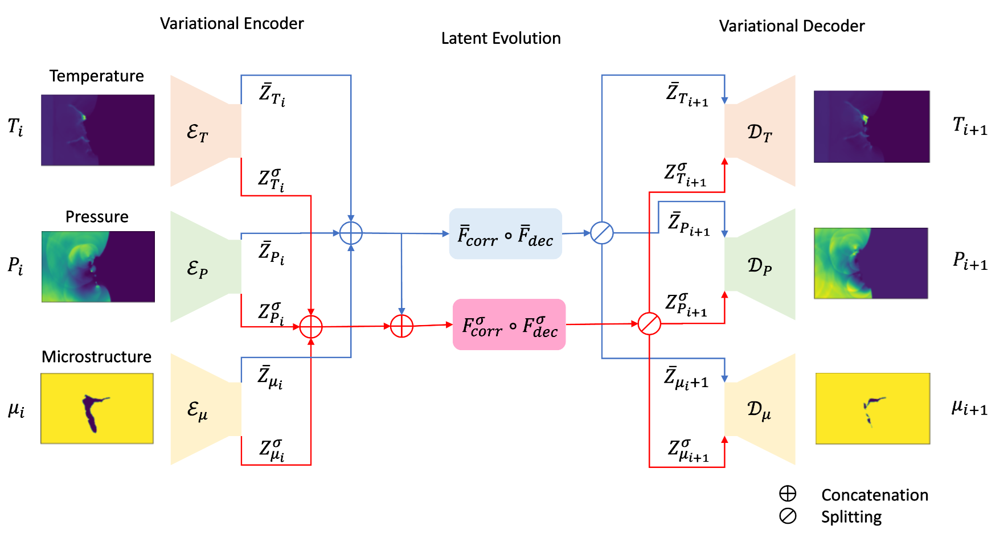

# Latent Representation Learning of Multiscale Thermophysics



We take a *meta-learning* approach to learn the time evolution of a set of coupled physical fields over various temporal and spatial scales in the case of shocked porous energetic material. Motivated by an analogy with the tokenization in Natural Language Processing (NLP), the underlying evolution of the physical fields over a larger-size, i.e., *meso-scale*, domain is considered as a *correlated* system of finer, i.e. *micro-scale*, building blocks. Our meta-learning approach is based on the following two interconnected stages of learning:

- A micro-level model `MicroDynamicsCoupledEfficient` learns a probabilistic latent representation of the micro-scale dynamics of the physical fields;  

- A coarse-level model `MesoDynamicsCoupledEfficient` learns the correlation between neighboring micro-scale building blocks, and combines the latent representations learned by the micro-scale model to predict the meso-scale dynamics.

The taxing computational cost of generating direct numerical simulations corresponding to the dynamics over larger-size domains poses practical challenges for training deep learning-based surrogate models from scratch which typically needs a large number of sample simulations. On the other hand, generating the micro-scale simulations is much cheaper compared to the meso-scale ones. The above-mentioned meta-learning approach makes it possible to learn a surrogate model of the coarse-level dynamics using only a few meso-scale sample simulations by transferring the latent representations learned at the micro-level through training over inexpensive simulations.   

## Getting Started

### Virtual Environment
It is recommended to create a virtual environment using [Miniconda](https://www.anaconda.com/docs/getting-started/miniconda/main) and install all the necessary packages within the virtual environment. To create a virtual environment named as `MLD`, type the following command in your terminal or command prompt.
```bash
conda create -n MLD python=3.11
```
Once the virtual environment has been created, run the following to activate the environment.
```bash
conda activate MLD
```

### Dependencies

#### TensorFlow
Tested and developed on TensorFlow 2.13.1. Make sure you follow the installation instructions in https://www.tensorflow.org/install to install TensorFlow2 according to your system configuration.
```bash
pip install tensorflow==2.13.1
```

#### Other Dependencies
```bash
pip install -r requirements.txt
```

### Jupyter Notebooks

The details of training and making prediction by our model are best described in the following notebooks: `Multiscale-Latent-Dynamics/demo/micro_dynamics.ipynb` and `Multiscale-Latent-Dynamics/demo/meso_dynamics.ipynb`. 


## Citation
To cite this work, please use the following:
```
@misc{azarfar2025latent,
      title=    {Latent Representation Learning of Multi-scale Thermophysics: Application to Dynamics in Shocked Porous Energetic Material}, 
      author=    {Shahab Azarfar and Joseph B. Choi and Phong CH. Nguyen and Yen T. Nguyen   and Pradeep Seshadri and H. S. Udaykumar and Stephen Baek},
      year=    {2025},
      eprint=   {2506.12996},
      archivePrefix=    {arXiv},
      primaryClass=    {physics.comp-ph},
      url=   {https://arxiv.org/abs/2506.12996}, 
}
```